# Driven Micro Domain Starter Kit

A complete working implementation and starter template for building domain-driven microservices using the [Driven Micro Framework](https://github.com/your-org/driven-micro). This repository demonstrates a full CQRS + Event Sourcing workflow with production-ready patterns.

**Why I Built This**: I created this starter kit and the underlying [Driven Micro Framework](https://github.com/your-org/driven-micro) after repeatedly rewriting the same architectural patterns for each new microservice. Instead of starting from scratch every time, this framework handles the core application architecture and message bus flow.

**How to Use**: Clone this starter kit to begin a new project. You'll implement your business logic in the domain layer while the framework manages the CQRS/Event Sourcing infrastructure.

**Current State**: The framework includes a DynamoDB persistence adapter, with plans for additional adapters covering LLM clients, file storage systems, and external services. Custom adapters are welcome—PRs accepted for both framework interfaces and concrete implementations.

[](https://www.typescriptlang.org/)
[](https://nodejs.org/)
[](tests/)
[](LICENSE)

## Purpose

This starter kit provides a **complete, working microservice implementation** that demonstrates how to use the Driven Micro Framework. It includes:

- **Full CQRS workflow chain** with command → event → command progression
- **Production-ready handlers** with error handling and logging
- **Comprehensive test suite** (74 tests) covering unit, integration, and E2E scenarios
- **Multiple deployment options** (API server, AWS Lambda)
- **Real-world patterns** extracted from production microservices

## Architecture Implementation

### Complete Workflow Chain

```mermaid
graph LR
    A[API Request] --> B[CreateCommand]
    B --> C[CreateCommandHandler]
    C --> D[DomainCreated Event]
    D --> E[DomainCreatedHandler]
    E --> F[ActCommand]
    F --> G[ActCommandHandler]
    G --> H[DomainActed Event]
    H --> I[DomainActedHandler]
    I --> J[StoreCommand]
    J --> K[StoreCommandHandler]
    K --> L[DomainStored Event]
    L --> M[DomainStoredHandler]
    M --> N[Workflow Complete]
```



### Architectural Patterns Demonstrated

#### **1. CQRS (Command Query Responsibility Segregation)**
- **Commands**: `CreateCommand`, `ActCommand`, `StoreCommand`
- **Events**: `DomainCreated`, `DomainActed`, `DomainStored`, `DomainFailed`
- **Clear separation** between state changes (commands) and notifications (events)

#### **2. Event Sourcing**
- **Event-driven workflow** where each step triggers the next
- **Domain events** capture state changes and drive business processes
- **Event handlers** orchestrate workflow progression

#### **3. Domain-Driven Design**
- **Domain aggregate** (`Domain` class) encapsulates business logic
- **Repository pattern** with `DynamoDBDomainRepository` for persistence
- **Unit of Work** pattern for transaction management

#### **4. Dependency Injection**
- **Inversify container** with interface-based abstractions
- **Clean separation** of concerns through DI
- **Testable architecture** with easy mocking

## Project Structure

```
src/domain/
├── src/
│   ├── models/                          # Domain Models
│   │   ├── Domain.ts                    # Main domain aggregate
│   │   └── Request.ts                   # Request model with validation
│   ├── service/
│   │   ├── messages/
│   │   │   ├── commands/                # Command Implementations
│   │   │   │   ├── CreateCommand.ts     # Create domain command
│   │   │   │   ├── ActCommand.ts        # Business logic command
│   │   │   │   └── StoreCommand.ts      # Persistence command
│   │   │   └── events/                  # Event Implementations
│   │   │       ├── DomainCreated.ts     # Domain created event
│   │   │       ├── DomainActed.ts       # Domain processed event
│   │   │       ├── DomainStored.ts      # Domain stored event
│   │   │       └── DomainFailed.ts      # Error event
│   │   ├── handlers/                    # Command & Event Handlers
│   │   │   ├── commands/
│   │   │   │   ├── CreateCommandHandler.ts    # Creates domain + emits DomainCreated
│   │   │   │   ├── ActCommandHandler.ts       # Business logic + emits DomainActed
│   │   │   │   └── StoreCommandHandler.ts     # Persistence + emits DomainStored
│   │   │   └── events/
│   │   │       ├── DomainCreatedHandler.ts    # Triggers ActCommand
│   │   │       ├── DomainActedHandler.ts      # Triggers StoreCommand
│   │   │       └── DomainStoredHandler.ts     # Workflow completion
│   │   └── units_of_work/
│   │       └── DynamoDBUnitOfWork.ts    # Transaction management
│   ├── adapters/
│   │   └── repos/
│   │       └── DynamoDBDomainRepository.ts    # DynamoDB persistence
│   ├── config/
│   │   └── types.ts                     # DI type definitions
│   └── entrypoints/
│       ├── api.ts                       # Hono API server
│       └── lambda.ts                    # AWS Lambda handler
├── tests/                               # Comprehensive Test Suite
│   ├── unit/                           # Unit Tests (handlers, models, messages)
│   ├── integration/                    # Integration Tests (repos, unit of work)
│   ├── e2e/                           # End-to-End Tests (API testing)
│   ├── setup.ts                       # Test configuration
│   └── run_individual_tests.txt       # Individual test commands
├── bootstrap.ts                        # Framework configuration
├── package.json                        # Dependencies & scripts
├── tsconfig.json                       # TypeScript configuration
└── jest.config.js                     # Test configuration
```

## Quick Start

### 1. Clone and Install

```bash
git clone https://github.com/your-org/driven-micro-domain.git my-microservice
cd my-microservice
npm install
```

### 2. Run Tests

```bash
# Run all tests
npm test

# Run specific test categories
npm run test:unit
npm run test:integration
npm run test:e2e

# Run individual test files
npm test -- tests/unit/models/Domain.test.ts
```

### 3. Start Development Server

```bash
# Start API server
npm run dev

# Server runs on http://localhost:4011
```

### 4. Test the API

```bash
# Create and process a domain
curl -X POST http://localhost:4011/run \
  -H "Content-Type: application/json" \
  -d '{"external_job_id": "test-job-001"}'

# Health check
curl http://localhost:4011/health
```

## Customization Guide

### 1. Define Your Domain

Replace the sample `Domain` class with your business logic:

```typescript
// src/models/MyDomain.ts
import { IDomain } from 'driven-micro';

export class MyDomain implements IDomain {
  constructor(
    public readonly external_job_id: string,
    public data: Record<string, any> = {}
  ) {}

  // Add your business methods
  processBusinessLogic(): void {
    this.data.processed = true;
    this.data.processedAt = new Date().toISOString();
    // Your domain logic here
  }

  updateData(newData: Record<string, any>): void {
    this.data = { ...this.data, ...newData };
  }

  serialize() {
    return {
      external_job_id: this.external_job_id,
      data: this.data,
      timestamp: new Date().toISOString()
    };
  }
}
```

### 2. Customize Request Validation

Update the `Request` class for your input requirements:

```typescript
// src/models/MyRequest.ts
import { IMicroServiceRequest } from 'driven-micro';

export class MyRequest implements IMicroServiceRequest {
  constructor(public readonly external_job_id: string) {}

  static validate(input: Record<string, any>): string[] {
    const errors: string[] = [];
    
    if (!input.external_job_id) {
      errors.push('external_job_id is required');
    }
    
    // Add your validation rules
    if (input.custom_field && typeof input.custom_field !== 'string') {
      errors.push('custom_field must be a string');
    }
    
    return errors;
  }

  static async create(input: Record<string, any>): Promise<MyRequest> {
    return new MyRequest(input.external_job_id);
  }

  serialize() {
    return { external_job_id: this.external_job_id };
  }
}
```

### 3. Implement Business Logic

Customize the `ActCommandHandler` with your processing logic:

```typescript
// src/service/handlers/commands/ActCommandHandler.ts
export class ActCommandHandler extends IHandler {
  async handle(command: ActCommand<MyDomain>): Promise<IMessage[]> {
    try {
      // Your business logic here
      command.domain.processBusinessLogic();
      
      // Additional processing
      await this.callExternalService(command.domain);
      
      this.addMessages([new DomainActed(command.domain)]);
      this.finish();
      
      return this._return_messages;
    } catch (error) {
      await this.logError(error.message);
      return [new DomainFailed(command.domain, error.message)];
    }
  }

  private async callExternalService(domain: MyDomain): Promise<void> {
    // Integrate with external APIs, LLMs, etc.
  }
}
```

### 4. Configure Dependencies

Update the bootstrap configuration for your repositories and services:

```typescript
// bootstrap.ts
const config: FrameworkConfig = {
  commandHandlers: new Map([
    [CreateCommand.name, CreateCommandHandler],
    [ActCommand.name, ActCommandHandler],
    [StoreCommand.name, StoreCommandHandler],
  ]),
  
  eventHandlers: new Map([
    [DomainCreated.name, DomainCreatedHandler],
    [DomainActed.name, DomainActedHandler],
    [DomainStored.name, DomainStoredHandler],
  ]),
  
  dependencies: (container: Container) => {
    container.bind(TYPES.DomainRepo).to(MyDomainRepository);
    container.bind(TYPES.UnitOfWork).to(MyUnitOfWork);
    // Add your custom services
    container.bind(TYPES.ExternalService).to(MyExternalService);
  }
};
```

## Testing Strategy

### Comprehensive Test Coverage (74 Tests)

#### **Unit Tests** (56 tests)
- **Models**: Domain and Request validation
- **Commands & Events**: Message creation and properties
- **Handlers**: Business logic and error handling

#### **Integration Tests** (13 tests)
- **Repository**: DynamoDB operations with mocking
- **Unit of Work**: Transaction management
- **Workflow**: End-to-end command/event chains

#### **E2E Tests** (5 tests)
- **API Endpoints**: Full HTTP request/response cycles
- **Error Handling**: Validation and error responses
- **Health Checks**: Service availability

### Running Tests

```bash
# All tests (sequential for resource management)
npm test

# Specific test categories
npm run test:unit
npm run test:integration
npm run test:e2e

# Individual test files (see tests/run_individual_tests.txt)
npm test -- tests/unit/handlers/commands/ActCommandHandler.test.ts

# With coverage
npm run test:coverage
```

### Test Configuration

- **Jest** with TypeScript support
- **AWS SDK mocking** for integration tests
- **Hono testing** for E2E API tests
- **Resource-friendly** configuration to prevent system overload

## Deployment Options

### 1. API Server (Development/Production)

```bash
# Development
npm run dev

# Production
npm run build
npm start
```

### 2. AWS Lambda

```typescript
// For Lambda deployment
import handler from './src/entrypoints/lambda';
export { handler };
```

Deploy using AWS CDK, Serverless Framework, or AWS SAM.

### 3. Docker Container

```dockerfile
FROM node:18-alpine
WORKDIR /app
COPY package*.json ./
RUN npm ci --only=production
COPY dist ./dist
EXPOSE 4011
CMD ["node", "dist/src/entrypoints/api.js"] # or lambda.js
```

## Configuration

### Environment Variables

```bash
# DynamoDB Configuration
DOMAIN_TABLE_NAME=my-domain-table  # Optional, defaults to 'domain-table'
AWS_REGION=us-east-1

# API Configuration  
API_PORT=4011
NODE_ENV=production

# AWS Configuration (for Lambda/DynamoDB)
AWS_ENDPOINT_URL=http://localhost:4566  # For LocalStack development
```

### LocalStack Development

```bash
# Start LocalStack
docker run -d -p 4566:4566 localstack/localstack

# Set environment for local development
export AWS_ENDPOINT_URL=http://localhost:4566
export DOMAIN_TABLE_NAME=local-domain-table
```

## Framework Integration

This starter kit uses the [Driven Micro Framework](https://github.com/your-org/driven-micro):

```typescript
// All framework imports use the package name
import { 
  IDomain, 
  ICommand, 
  IEvent, 
  IHandler,
  bootstrap,
  createApiEntryPoint 
} from 'driven-micro';
```

## Examples & Patterns

### Error Handling Pattern
```typescript
class MyHandler extends IHandler {
  async handle(command: MyCommand): Promise<IMessage[]> {
    try {
      // Business logic
      return [new SuccessEvent(result)];
    } catch (error) {
      await this.logError(error.message, command.external_job_id);
      return [new DomainFailed(command.domain, error.message)];
    }
  }
}
```

### External Service Integration
```typescript
class ActCommandHandler extends IHandler {
  constructor(
    @inject(TYPES.ExternalService) private externalService: IExternalService
  ) {
    super();
  }

  async handle(command: ActCommand): Promise<IMessage[]> {
    // Call external service
    const result = await this.externalService.process(command.domain.data);
    
    // Update domain with result
    command.domain.updateData({ result });
    
    return [new DomainActed(command.domain)];
  }
}
```

## Contributing

1. Fork the repository
2. Create a feature branch (`git checkout -b feature/amazing-feature`)
3. Add tests for your changes
4. Ensure all tests pass (`npm test`)
5. Commit your changes (`git commit -m 'Add amazing feature'`)
6. Push to the branch (`git push origin feature/amazing-feature`)
7. Open a Pull Request

## License

This project is licensed under the MIT License - see the [LICENSE](LICENSE) file for details.